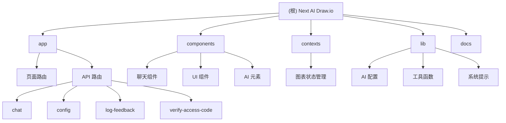

# Next AI Draw.io - AI 驱动的图表生成工具

> 更新时间：2025-12-14 09:59:11
>
> 一个集成 AI 能力与 draw.io 图表的 Next.js Web 应用程序。通过自然语言命令和 AI 辅助可视化来创建、修改和增强图表。

## 项目愿景

让任何人都能通过简单的对话来创建专业的技术图表、架构图和流程图。无需学习复杂的图表工具，只需用自然语言描述您的想法，AI 就会为您生成相应的图表。

## 架构总览

### 技术栈
- **前端框架**: Next.js 16 (App Router)
- **UI 框架**: React 19
- **样式方案**: Tailwind CSS 4
- **AI 集成**: Vercel AI SDK + 多提供商支持
- **图表引擎**: react-drawio (embed.diagrams.net)
- **状态管理**: React Context
- **开发工具**: Biome (替代 ESLint + Prettier)
- **部署**: Vercel / Docker

### 核心特性
- 🤖 **多 AI 提供商支持**: OpenAI、Anthropic、Google、Azure、AWS Bedrock、Ollama 等
- 📊 **专业图表生成**: AWS/GCP/Azure 云架构图、流程图、技术图表
- 📁 **文件上传支持**: 图片复制、PDF 和文本文件解析
- 🔄 **版本历史**: 完整的图表版本控制，可查看和恢复历史版本
- 🎨 **主题切换**: 支持亮色/暗色主题，多种 UI 风格
- 💾 **多种导出格式**: .drawio、.svg、.png
- ⚡ **实时协作**: 通过聊天界面实时修改图表

## ✨ 模块结构图



## 模块索引

| 模块路径 | 主要技术 | 职责描述 | 文档覆盖率 |
|---------|----------|----------|------------|
| **app** | Next.js Router, TypeScript | 应用路由和 API 端点 | 待创建 |
| **components** | React, Tailwind CSS | UI 组件和交互逻辑 | 待创建 |
| **contexts** | React Context | 全局状态管理 | 待创建 |
| **lib** | TypeScript | 工具函数和 AI 配置 | 待创建 |
| **docs** | Markdown | 项目文档和部署指南 | 待创建 |

## 运行与开发

### 环境要求
- Node.js 20+
- npm 或 yarn

### 快速开始

1. **克隆项目**
```bash
git clone https://github.com/DayuanJiang/next-ai-draw-io
cd next-ai-draw-io
```

2. **安装依赖**
```bash
npm install
```

3. **配置环境变量**
```bash
cp env.example .env.local
# 编辑 .env.local，配置 AI 提供商和 API 密钥
```

4. **启动开发服务器**
```bash
npm run dev
# 访问 http://localhost:6002
```

### 开发命令

```bash
# 开发服务器（使用 Turbopack）
npm run dev

# 构建生产版本
npm run build

# 启动生产服务器
npm run start

# 代码检查
npm run lint

# 代码格式化
npm run format

# 运行所有检查（CI 模式）
npm run check
```

## 测试策略

### 当前状态
- 项目目前没有自动化测试
- 依赖手动测试和代码检查工具

### 建议的测试框架
- **单元测试**: Jest + React Testing Library
- **E2E 测试**: Playwright
- **API 测试**: 基于 Next.js 的测试工具

### 测试覆盖优先级
1. **核心功能测试**
   - AI 聊天流程
   - 图表生成和编辑
   - 文件上传功能

2. **组件测试**
   - UI 组件渲染
   - 用户交互
   - 响应式布局

3. **API 测试**
   - 路由处理
   - 错误处理
   - 权限验证

## 编码规范

### 代码风格
- 使用 **Biome** 进行代码格式化和检查
- TypeScript 严格模式
- 组件使用函数式组件和 Hooks
- 遵循 React 19 最佳实践

### 文件命名
- 组件文件使用 `kebab-case.tsx`
- 工具函数使用 `kebab-case.ts`
- 页面文件使用 `page.tsx`（App Router）
- API 路由使用 `route.ts`

### 目录结构规范
```
src/
├── app/              # Next.js App Router
│   ├── api/         # API 路由
│   ├── [locale]/    # 国际化路由
│   └── globals.css  # 全局样式
├── components/       # React 组件
│   ├── ui/          # 基础 UI 组件
│   └── feature/     # 功能组件
├── contexts/         # React Context
├── lib/             # 工具函数和配置
└── public/          # 静态资源
```

## AI 使用指引

### 支持的 AI 提供商

1. **AWS Bedrock**（默认）
   - 支持 Claude、Titan 等模型
   - 需要 AWS 凭证配置

2. **OpenAI**
   - GPT-4、GPT-4o 系列
   - 支持自定义端点

3. **Anthropic**
   - Claude 3.5 Sonnet、Claude Opus
   - 推荐用于图表生成

4. **Google AI**
   - Gemini 系列
   - 支持推理模型

5. **Azure OpenAI**
   - 企业级部署
   - 支持自定义实例

6. **本地部署**
   - Ollama（本地模型）
   - OpenRouter（模型聚合）

### 模型选择建议

- **最佳效果**: Claude Sonnet 4.5 / Claude Opus 4.5
- **性价比**: GPT-4o / Gemini 1.5 Pro
- **本地部署**: Ollama + Llama 3
- **特殊需求**: o1/o3 系列用于复杂推理

### 系统提示词策略

项目使用了两级系统提示词：
- **默认提示词** (~1900 tokens): 适用于所有模型
- **扩展提示词** (~4500 tokens): 适用于支持大缓存的高阶模型

提示词包含：
- 图表生成专家角色定义
- 应用功能说明
- 工具使用指南
- XML 生成最佳实践

## 部署指南

### Vercel 部署（推荐）

1. 连接 GitHub 仓库到 Vercel
2. 配置环境变量
3. 自动部署

### Docker 部署

```bash
# 使用预构建镜像
docker run -d -p 3000:3000 \
  -e AI_PROVIDER=openai \
  -e AI_MODEL=gpt-4o \
  -e OPENAI_API_KEY=your_api_key \
  ghcr.io/dayuanjiang/next-ai-draw-io:latest

# 或使用 env 文件
docker run -d -p 3000:3000 --env-file .env \
  ghcr.io/dayuanjiang/next-ai-draw-io:latest
```

### 自托管部署

1. 构建项目
```bash
npm run build
```

2. 配置反向代理（Nginx）
3. 设置 SSL 证书
4. 配置环境变量

## 性能优化

### 前端优化
- 使用 Next.js 16 的 Turbopack
- 组件懒加载
- 图片优化
- CDN 加速

### AI 优化
- 响应缓存机制
- Token 使用优化
- 历史消息压缩
- 流式响应

### 部署优化
- Vercel Edge Functions
- Docker 多阶段构建
- 静态资源 CDN

## 常见问题

### Q: 如何配置自定义 AI 提供商？
A: 在设置面板中可以选择提供商并输入 API 密钥。支持客户端覆盖服务端配置。

### Q: 图表历史如何保存？
A: 图表历史保存在浏览器本地存储中，每次 AI 编辑前自动创建快照。

### Q: 是否支持离线部署？
A: 是的，见 [离线部署指南](./docs/offline-deployment.md)。

### Q: 如何添加新的云服务图标？
A: 可以通过修改 draw.io 的 XML 模板来添加自定义图标。

## 变更记录 (Changelog)

### 2025-12-14 09:59:11
- 🎯 **初始化架构师文档**: 完成项目整体结构分析
- 📊 **技术栈识别**: Next.js 16 + React 19 + Tailwind CSS 4
- 🤖 **AI 集成分析**: 多提供商支持，Vercel AI SDK
- 📝 **文档规划**: 5个主要模块待创建详细文档
- 🔍 **代码扫描**: 85+ TypeScript/React 文件，无测试文件
- ⚠️ **识别缺口**: 缺少测试体系、部分 API 路由未详细分析

---

*提示：点击上方模块名称或 Mermaid 图表中的节点可快速跳转到对应模块的详细文档。*